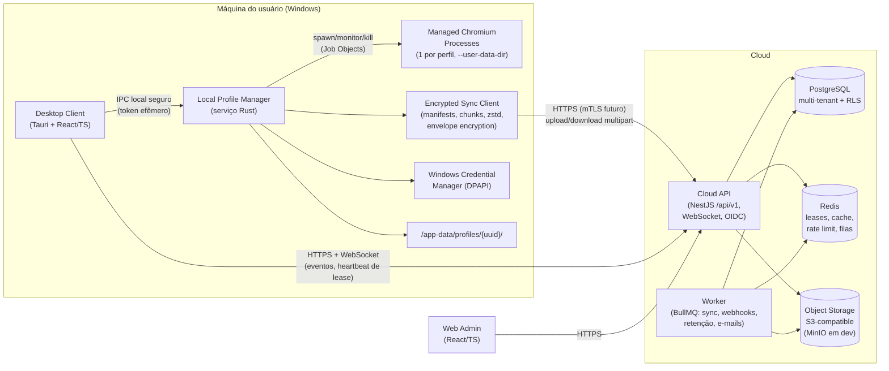

# ARCHITECTURE — Browser Workspace

> Visão geral da arquitetura. Fonte: `docs/SPEC_SOURCE.md`. Decisões de stack: `docs/adr/ADR-001-desktop-stack.md` (Tauri+Rust), `docs/adr/ADR-002-backend-stack.md` (NestJS/Fastify+TS).
> Limites éticos da spec valem para TODO o sistema: sem fingerprint spoofing, sem evasão de antifraude, automação apenas em allowlist do próprio cliente.

## 1. Diagrama geral



## 2. Monorepo

```
/apps
  /desktop       # Tauri (Rust) + React/TS — cliente Windows (ADR-001)
  /web-admin     # React/TS — painel administrativo da plataforma
  /api           # NestJS — Cloud API /api/v1 + WebSocket (ADR-002)
  /worker        # NestJS standalone — consumidores BullMQ
/packages
  /ui            # design system React compartilhado (desktop + web-admin)
  /contracts     # schemas Zod: DTOs, eventos WS, erros RFC 7807 — source of truth
  /database      # Drizzle ORM, migrations reversíveis, seeds, helpers RLS
  /crypto        # envelope encryption (DEK/KEK), BLAKE3, assinaturas HMAC — TS; espelho Rust no desktop
  /logging       # logger estruturado (pino) + convenções OTel + redação de segredos
  /config        # carga/validação de config por ambiente (Zod)
  /validation    # validadores de domínio reutilizáveis (nomes, proxies, flags)
  /browser-core  # (Rust crate + tipos TS) descoberta de Chromium, flags, versões
  /sync-engine   # protocolo de sync: manifests, chunking, retomada (TS + espelho Rust)
  /automation-sdk# SDK de automação autorizada (F5, Playwright + allowlist)
/infrastructure
  /docker        # docker-compose dev: api, worker, pg, redis, minio, otel, maildev
  /terraform     # provisionamento cloud (staging/prod)
  /monitoring    # dashboards, alertas, SLOs
```

Regras:
- `/packages/contracts` é a **fonte única de contratos**; OpenAPI e SDK TS são gerados dele.
- Nenhum app importa outro app; comunicação inter-apps só por contratos.
- Código Rust do desktop consome contratos via geração de tipos (schema JSON → serde) no build.

## 3. Componentes

### 3.1 Desktop Client (UI)
React/TS dentro do WebView2 (Tauri). Só renderiza estado e emite comandos; **nunca** toca segredos, arquivos de perfil ou processos diretamente. Detalhes: `DESKTOP_ARCHITECTURE.md`.

### 3.2 Local Profile Manager (LPM)
Serviço Rust (módulo do app Tauri no MVP; extraível para Windows Service). Responsável por: diretórios isolados, ciclo de vida dos Chromium, leases (cliente), crash/órfãos, segredos (DPAPI), orquestração do sync client.

### 3.3 Managed Chromium
Processos externos, um por perfil aberto, lançados com `--user-data-dir` exclusivo. O produto não modifica o Chromium nem injeta alteração de fingerprint — isolamento vem exclusivamente do diretório de dados separado.

### 3.4 Encrypted Sync Client
Implementa `SYNC_PROTOCOL.md`: inventário → manifest → chunks zstd → upload multipart retomável → snapshot. Cifra dados de perfil com DEK antes do upload.

### 3.5 Cloud API
NestJS. Autoridade sobre: identidade/permissões (validação SEMPRE no backend), leases, metadados de perfis, manifests/snapshots, auditoria, entitlements. Expõe REST `/api/v1` + WebSocket. Ver `API_SPEC.md`.

### 3.6 Worker
Consome filas BullMQ: finalização de snapshots, verificação de integridade, entrega de webhooks (HMAC, retry exponencial), e-mails, retenção/expurgo, expiração de leases (varredura de segurança além do TTL do Redis).

### 3.7 Dados
- **PostgreSQL**: fonte de verdade relacional; toda tabela de tenant tem `organization_id`; RLS como defesa adicional (a autorização primária é na aplicação); soft delete + versionamento otimista (`record_version`).
- **Redis**: lease lock (rápido), cache de entitlements/permissões, rate limiting, pub/sub para WS multi-instância, filas.
- **Object Storage**: chunks e snapshots cifrados; nomeação `orgs/{org_id}/profiles/{profile_id}/snapshots/{snapshot_id}/...`; políticas de retenção por plano.

## 4. Fluxos principais

### 4.1 Abertura de perfil (13 passos — spec)

```mermaid
sequenceDiagram
    autonumber
    participant U as UI
    participant L as LPM (local)
    participant A as Cloud API
    participant C as Chromium

    U->>L: abrir perfil {uuid}
    L->>A: 1. verificar permissão (profiles.open)
    A-->>L: autorizado
    L->>A: 2. adquirir lease (device_id, ttl)
    A-->>L: lease {id, token, expires_at}
    L->>A: 3. sync check (versão local vs snapshot remoto)
    A-->>L: manifest delta
    L->>L: 4. download de dados pendentes (se houver)
    L->>L: 5. verificação de integridade (checksums, formato do diretório)
    L->>L: 6. verificação de versão do Chromium (compatível? bloqueada?)
    L->>L: 7. montar config de rede (proxy do perfil, credenciais via DPAPI)
    L->>C: 8. iniciar processo (--user-data-dir, flags; Job Object)
    L->>A: 9. registrar evento de abertura (auditoria)
    loop enquanto aberto
        L->>A: 10. heartbeat do lease (renovação)
        L->>L: 11. monitorar processo (crash? órfão? memória?)
    end
    C-->>L: processo encerrou
    L->>A: 12. sync pós-encerramento (upload snapshot)
    L->>A: 13. liberar lease + evento de encerramento
```

Falha em qualquer passo 1–8 → aborta com rollback (lease liberado, evento de falha auditado, perfil volta a `disponivel` ou vai a `com_erro`).

### 4.2 Sincronização
Resumo (detalhe em `SYNC_PROTOCOL.md`): o cliente calcula inventário com checksums BLAKE3, negocia delta contra o último manifest, sobe apenas chunks novos (zstd, multipart retomável), servidor finaliza snapshot atômico. Download é o inverso, com verificação de integridade antes de ativar. **Falha de sync nunca destrói dados locais** (critério 14 do MVP): novo estado só substitui o antigo após validação completa, via troca atômica de diretório.

### 4.3 Lease distribuído com heartbeat

- **Objetivo**: um perfil NUNCA aberto em duas máquinas simultaneamente (critério 3 do MVP).
- **Autoridade**: Cloud API. Registro persistente em `profile_leases` (PG) + lock rápido em Redis (`SET lease:{profile_id} {device_session_id} NX PX {ttl}`).
- **Aquisição**: transação — confirma permissão, ausência de lease ativo, grava lease com `expires_at`, emite evento WS `profile.lease.acquired` para a org.
- **Heartbeat**: cliente renova a cada `ttl/3` (ex.: ttl 90 s, heartbeat 30 s). Renovação atômica (script Lua compara `device_session_id`).
- **Expiração**: sem heartbeat até `expires_at` → worker marca lease expirado, perfil `com_erro` até reconciliação; próximo cliente pode adquirir.
- **Recuperação pós-falha**: cliente que reinicia e encontra lease próprio ainda válido pode retomá-lo (mesmo `device_session_id`); se expirou, faz reconciliação local (crash recovery) antes de novo ciclo.
- **Encerramento forçado por admin**: revoga lease + comando WS ao dispositivo para encerrar o Chromium com sync de emergência; auditado com justificativa.
- **Anti-race**: unicidade em PG (`UNIQUE (profile_id) WHERE released_at IS NULL`) é a barreira final; Redis é otimização, nunca autoridade.
- **Offline**: sem lease confirmado pela API, o perfil não abre (MVP não tem modo offline para perfis sincronizados).

## 5. Comunicação

| Canal | Tecnologia | Segurança |
|---|---|---|
| UI ↔ LPM | Comandos Tauri (in-process no MVP); pós-extração: loopback `127.0.0.1` HTTP | Token efêmero por sessão gerado no boot do serviço, entregue só ao processo UI; validação de origem; sem portas públicas; allowlist de comandos |
| Desktop ↔ Cloud | HTTPS (TLS 1.3) REST + WebSocket | OAuth2.1 (access curto + refresh com rotação e detecção de reuso); WS autenticado por token curto no handshake; certificate pinning avaliado em F7 |
| Web Admin ↔ Cloud | HTTPS | Sessão OIDC, MFA obrigatório para papéis administrativos |
| API ↔ Worker | BullMQ (Redis) + outbox no PG para eventos críticos | Rede privada; payloads sem segredos |
| Webhooks (saída) | HTTPS | Assinatura HMAC-SHA256, timestamp anti-replay, retries com backoff |

## 6. Multi-tenancy

- Hierarquia: **plataforma → organização → workspace → equipe → usuário**; recursos (perfis, redes, extensões, favoritos, dispositivos) pertencem a uma organização.
- **Toda** query de tenant filtra `organization_id` derivado do token — nunca de parâmetro do cliente.
- Autorização: RBAC (8 papéis da spec) + permissões granulares, resolvidas por um `AuthorizationService` central; **validação sempre no backend** — a UI apenas esconde ações.
- RLS no PostgreSQL como camada adicional (`SET LOCAL app.current_org_id`), pega bugs de aplicação (cenário de teste 11: acesso cross-org).
- `EntitlementService` central para limites de plano — nenhum check de limite espalhado em handlers.
- Storage: prefixos por org; impossibilidade de URL pré-assinada cruzar org (chave inclui org_id validado server-side).

## 7. Princípios (ordem de decisão em conflito)

1. **Segurança** — segredos fora de logs/diretórios de perfil; criptografia em trânsito e repouso; menor privilégio.
2. **Isolamento** — entre perfis (diretórios), entre tenants (org_id + RLS), entre UI e segredos.
3. **Integridade** — checksums, snapshots atômicos, versionamento otimista, migrations reversíveis.
4. **Conformidade** — LGPD (exclusão, exportação, retenção, consentimento), auditoria imutável, limites éticos da spec.
5. **Recuperação de falhas** — crash recovery, retomada de sync, rollback de snapshot, leases expiráveis.
6. **UX** — estados de loading/empty/error, operações em lote, feedback de sync.
7. **Performance** — depois de tudo acima; escala horizontal na API, streaming no sync.
8. **Quantidade de features** — por último; MVP enxuto (Windows-only, ver SPEC_SOURCE §MVP).

## 8. Documentos relacionados

- `docs/DESKTOP_ARCHITECTURE.md` — processos, state machine de perfil, Chromium, telas.
- `docs/SYNC_PROTOCOL.md` — protocolo de sincronização e criptografia.
- `docs/API_SPEC.md` — convenções e recursos da API `/api/v1`.
- `docs/adr/` — decisões arquiteturais.
