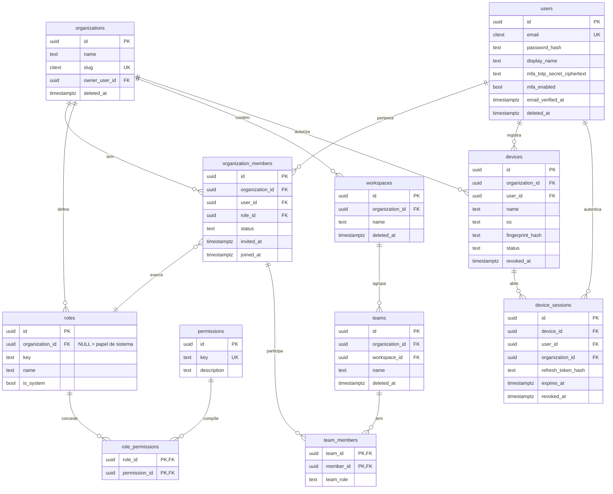
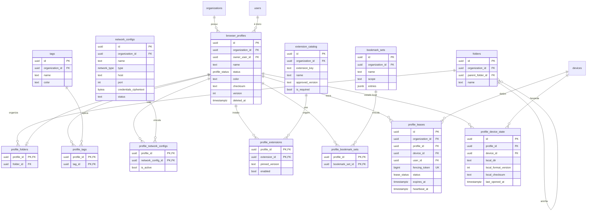
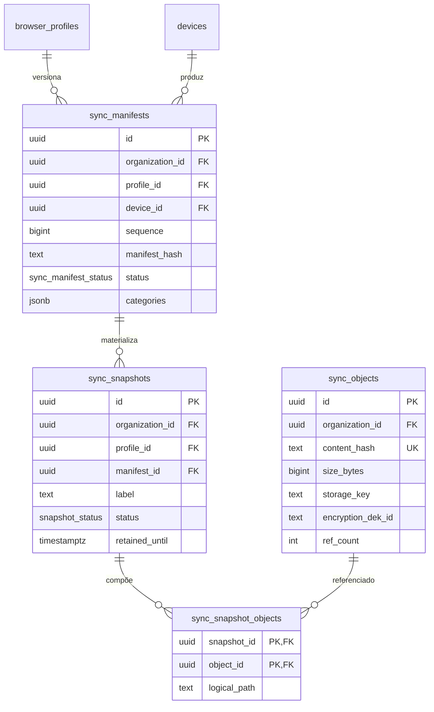
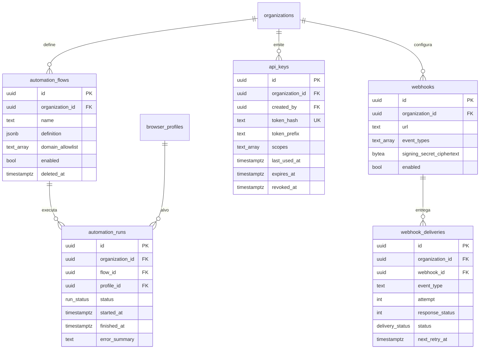
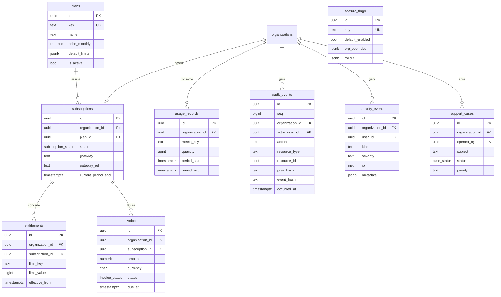

# DATA_MODEL — Browser Workspace

> Modelo de dados PostgreSQL (>= 15). Derivado de `docs/SPEC_SOURCE.md`, seção "Banco" e seções correlatas (Perfis, Times, Sync, Auditoria, Planos).
> Este documento é a fonte para escrita direta das migrations. Qualquer alteração de schema deve ser refletida aqui ANTES da migration.

---

## 1. Convenções globais

| Convenção | Regra |
|---|---|
| PK | `id uuid PRIMARY KEY DEFAULT gen_random_uuid()` em todas as tabelas (exceto tabelas de junção puras, que podem usar PK composta — indicado caso a caso) |
| Timestamps | `created_at timestamptz NOT NULL DEFAULT now()`, `updated_at timestamptz NOT NULL DEFAULT now()` (trigger `set_updated_at` em BEFORE UPDATE) |
| Soft delete | `deleted_at timestamptz NULL` onde indicado. Queries de leitura filtram `deleted_at IS NULL`. Unicidade convive com soft delete via índice parcial `WHERE deleted_at IS NULL` |
| Lock otimista | `version integer NOT NULL DEFAULT 1` onde indicado; `UPDATE ... SET version = version + 1 WHERE id = $1 AND version = $2` |
| Multi-tenant | `organization_id uuid NOT NULL REFERENCES organizations(id)` em TODA tabela tenant-scoped (mesmo quando derivável por join — desnormalização deliberada para RLS e índices) |
| FKs | `ON DELETE RESTRICT` por padrão; `ON DELETE CASCADE` apenas em tabelas de junção e filhas sem valor próprio (ex.: `webhook_deliveries`) |
| Enums | Tipos `CREATE TYPE ... AS ENUM` nomeados `<dominio>_<campo>` (ex.: `profile_status`). Alternativa aceita: `text + CHECK` para enums voláteis |
| Nomes | snake_case, plural para tabelas, singular para colunas |
| Dinheiro | `numeric(12,2)` + `currency char(3)` (ISO 4217). Nunca float |
| Segredos | NUNCA em plaintext. Colunas `*_ciphertext bytea` com envelope encryption (ver §4.4). NUNCA logar |

Tabelas **globais** (sem `organization_id`): `users`, `organizations`, `permissions`, `plans`, `feature_flags` (escopo global com override por org via `feature_flag_overrides` embutido em jsonb — ver tabela), `extension_catalog` (catálogo global + entradas por org, ver nota).

---

## 2. ERD por domínio

### 2.1 Identidade, RBAC e organização



### 2.2 Perfis e recursos vinculados



### 2.3 Sincronização



> `sync_snapshot_objects` é tabela auxiliar de junção (dedup N:N entre snapshots e objetos) — adicional às 39 mínimas, necessária para o dedup por content hash exigido na spec.

### 2.4 Automação, API pública e webhooks



### 2.5 Billing, plataforma, auditoria e segurança



---

## 3. Dicionário de dados

Legenda: **N** = NOT NULL. Colunas padrão (`id`, `created_at`, `updated_at`) omitidas — presentes em todas, salvo nota. `version`/`deleted_at` listados só quando existem.

### 3.1 Identidade e RBAC

#### users (global)
| Coluna | Tipo | Null | Default | Obs |
|---|---|---|---|---|
| email | citext | N | — | UNIQUE parcial `WHERE deleted_at IS NULL` |
| password_hash | text | N | — | Argon2id (formato PHC). Nunca exposto na API |
| display_name | text | N | — | |
| locale | text | N | `'pt-BR'` | |
| mfa_enabled | boolean | N | `false` | |
| mfa_totp_secret_ciphertext | bytea | S | — | Envelope encryption; NULL se MFA off |
| mfa_recovery_codes_hash | jsonb | S | — | Array de hashes (Argon2id) dos códigos; consumidos = removidos |
| email_verified_at | timestamptz | S | — | NULL = não verificado |
| last_login_at | timestamptz | S | — | |
| failed_login_count | integer | N | `0` | Anti credential-stuffing (com rate limit em Redis) |
| locked_until | timestamptz | S | — | Lockout temporário |
| deleted_at | timestamptz | S | — | Exclusão LGPD = soft delete + anonimização de PII |
| version | integer | N | `1` | |

#### organizations (global)
| Coluna | Tipo | Null | Default | Obs |
|---|---|---|---|---|
| name | text | N | — | |
| slug | citext | N | — | UNIQUE parcial `WHERE deleted_at IS NULL` |
| owner_user_id | uuid | N | — | FK users. Sempre também membro Admin |
| settings | jsonb | N | `'{}'` | Políticas da org (retenção, MFA obrigatório etc.) |
| deleted_at | timestamptz | S | — | |
| version | integer | N | `1` | |

#### organization_members
| Coluna | Tipo | Null | Default | Obs |
|---|---|---|---|---|
| organization_id | uuid | N | — | FK organizations |
| user_id | uuid | N | — | FK users |
| role_id | uuid | N | — | FK roles |
| status | text | N | `'invited'` | CHECK IN ('invited','active','suspended','removed') |
| invited_by | uuid | S | — | FK users |
| invited_at | timestamptz | S | — | |
| joined_at | timestamptz | S | — | |
| version | integer | N | `1` | |

UNIQUE `(organization_id, user_id)`.

#### roles
| Coluna | Tipo | Null | Default | Obs |
|---|---|---|---|---|
| organization_id | uuid | S | — | NULL = papel de sistema (Superadmin, Admin, Gerente, Operador, Auditor, Financeiro, Suporte, Somente leitura). NOT NULL = papel custom da org |
| key | text | N | — | ex.: `org_admin`, `operator` |
| name | text | N | — | |
| description | text | S | — | |
| is_system | boolean | N | `false` | Papéis de sistema são imutáveis via API |

UNIQUE `(organization_id, key)` com `NULLS NOT DISTINCT` (papéis de sistema únicos globalmente).

#### permissions (global, seed fixo)
| Coluna | Tipo | Null | Default | Obs |
|---|---|---|---|---|
| key | text | N | — | UNIQUE. ex.: `profile.open`, `profile.delete`, `network.manage`, `secrets.view`, `audit.view`, `billing.manage`, `api.manage`, `automation.manage`, `session.terminate_others` |
| description | text | N | — | |

Sem `updated_at`/soft delete — catálogo controlado por migration/seed.

#### role_permissions (junção)
PK composta `(role_id, permission_id)`. FKs com `ON DELETE CASCADE`. Apenas `created_at`.

#### workspaces
| Coluna | Tipo | Null | Default | Obs |
|---|---|---|---|---|
| organization_id | uuid | N | — | FK |
| name | text | N | — | UNIQUE `(organization_id, name)` parcial `WHERE deleted_at IS NULL` |
| description | text | S | — | |
| deleted_at | timestamptz | S | — | |
| version | integer | N | `1` | |

#### teams
| Coluna | Tipo | Null | Default | Obs |
|---|---|---|---|---|
| organization_id | uuid | N | — | FK (desnormalizado; deve coincidir com o workspace) |
| workspace_id | uuid | N | — | FK workspaces |
| name | text | N | — | UNIQUE `(workspace_id, name)` parcial `WHERE deleted_at IS NULL` |
| deleted_at | timestamptz | S | — | |
| version | integer | N | `1` | |

#### team_members (junção)
PK composta `(team_id, member_id)`. `member_id` FK `organization_members(id)` (não `users` — garante que só membros da org entram no time). `team_role text NOT NULL DEFAULT 'member'` CHECK IN ('lead','member'). Apenas `created_at`.

#### devices
| Coluna | Tipo | Null | Default | Obs |
|---|---|---|---|---|
| organization_id | uuid | N | — | FK |
| user_id | uuid | N | — | FK users — dono do registro |
| name | text | N | — | Nome amigável ("Notebook Ricardo") |
| os | text | N | — | CHECK IN ('windows','macos','linux') |
| os_version | text | S | — | |
| app_version | text | S | — | Versão do desktop client |
| fingerprint_hash | text | N | — | Hash de identificação estável do dispositivo (não spoofing — identificação do PRÓPRIO cliente). UNIQUE `(organization_id, fingerprint_hash)` |
| is_trusted | boolean | N | `false` | Dispositivo confiável (auth) |
| status | text | N | `'active'` | CHECK IN ('active','revoked','pending') |
| last_seen_at | timestamptz | S | — | |
| revoked_at | timestamptz | S | — | Revogação dispara revogação de DEKs cacheadas (ver crypto) |
| version | integer | N | `1` | |

#### device_sessions
| Coluna | Tipo | Null | Default | Obs |
|---|---|---|---|---|
| organization_id | uuid | N | — | FK |
| device_id | uuid | N | — | FK devices |
| user_id | uuid | N | — | FK users |
| refresh_token_hash | text | N | — | SHA-256 do refresh token. UNIQUE |
| refresh_token_family | uuid | N | — | Detecção de reuso: reuso de token antigo da família ⇒ revoga família inteira |
| ip | inet | S | — | |
| user_agent | text | S | — | |
| expires_at | timestamptz | N | — | |
| revoked_at | timestamptz | S | — | |
| revoked_reason | text | S | — | CHECK IN ('logout','admin','reuse_detected','expired','device_revoked') quando não NULL |

Sem `updated_at` de negócio relevante; manter padrão. Sem soft delete (retenção via job de purge).

### 3.2 Perfis e recursos

#### browser_profiles
| Coluna | Tipo | Null | Default | Obs |
|---|---|---|---|---|
| organization_id | uuid | N | — | FK |
| owner_user_id | uuid | N | — | FK users |
| name | text | N | — | UNIQUE `(organization_id, name)` parcial `WHERE deleted_at IS NULL` |
| description | text | S | — | |
| status | profile_status | N | `'available'` | ENUM: `available`, `in_use`, `syncing`, `locked`, `error`, `archived`, `deleted`, `pending_update` (os 8 status da spec) |
| color | text | S | — | CHECK regex `^#[0-9a-fA-F]{6}$` |
| avatar_url | text | S | — | |
| browser_kind | text | N | `'chromium'` | |
| browser_version | text | S | — | Última versão Chromium usada |
| declared_os | text | S | — | SO real declarado (transparência — não spoofing) |
| policies | jsonb | N | `'{}'` | Políticas corporativas aplicadas |
| notes | text | S | — | |
| custom_fields | jsonb | N | `'{}'` | |
| checksum | text | S | — | Hash do último estado sincronizado (integridade). NULL até primeiro sync |
| sync_status | text | N | `'never_synced'` | CHECK IN ('never_synced','in_sync','pending','conflict','failed') |
| last_opened_at | timestamptz | S | — | |
| last_opened_by | uuid | S | — | FK users |
| last_opened_device_id | uuid | S | — | FK devices |
| retention_policy | jsonb | S | — | Override de retenção |
| archived_at | timestamptz | S | — | |
| deleted_at | timestamptz | S | — | Soft delete com janela de recuperação (critério MVP #15) |
| version | integer | N | `1` | Lock otimista — obrigatório em todo UPDATE |

> **`local_dir` NUNCA no banco cloud.** O caminho local (`/app-data/profiles/{uuid}/`) é uma propriedade do PAR (perfil, dispositivo) — o mesmo perfil vive em caminhos diferentes em máquinas diferentes, e o caminho vaza estrutura do filesystem do usuário. Modelado em **`profile_device_state`** (abaixo). O banco local (SQLite) do desktop client é quem persiste isso com autoridade; a cópia cloud em `profile_device_state` existe só para diagnóstico/suporte e pode ficar vazia se a org desativar telemetria.

#### profile_device_state (auxiliar — decisão de modelagem)
| Coluna | Tipo | Null | Default | Obs |
|---|---|---|---|---|
| organization_id | uuid | N | — | FK |
| profile_id | uuid | N | — | FK browser_profiles ON DELETE CASCADE |
| device_id | uuid | N | — | FK devices ON DELETE CASCADE |
| local_dir | text | S | — | Caminho local relatado pelo dispositivo (diagnóstico) |
| local_format_version | integer | N | `1` | Versão do formato do diretório de perfil |
| local_checksum | text | S | — | Checksum do estado local relatado |
| disk_usage_bytes | bigint | S | — | |
| crash_detected_at | timestamptz | S | — | Última detecção de crash |
| last_opened_at | timestamptz | S | — | |
| last_synced_at | timestamptz | S | — | |

UNIQUE `(profile_id, device_id)`.

#### folders
| Coluna | Tipo | Null | Default | Obs |
|---|---|---|---|---|
| organization_id | uuid | N | — | FK |
| parent_folder_id | uuid | S | — | FK folders (árvore); NULL = raiz. CHECK `parent_folder_id <> id` + validação de ciclo na aplicação |
| name | text | N | — | UNIQUE `(organization_id, parent_folder_id, name)` `NULLS NOT DISTINCT`, parcial `WHERE deleted_at IS NULL` |
| position | integer | N | `0` | Ordenação manual |
| deleted_at | timestamptz | S | — | |
| version | integer | N | `1` | |

#### profile_folders (junção 1:1 efetiva)
PK `profile_id` (um perfil está em no máximo UMA pasta — modelado como junção para manter a tabela da spec e permitir mover sem tocar em `browser_profiles`). `folder_id uuid NOT NULL` FK. `organization_id NOT NULL`. Apenas `created_at`/`updated_at`.

#### tags
| Coluna | Tipo | Null | Default | Obs |
|---|---|---|---|---|
| organization_id | uuid | N | — | FK |
| name | citext | N | — | UNIQUE `(organization_id, name)` parcial `WHERE deleted_at IS NULL` |
| color | text | S | — | CHECK regex hex |
| deleted_at | timestamptz | S | — | |

#### profile_tags (junção)
PK composta `(profile_id, tag_id)`. `organization_id NOT NULL`. FKs `ON DELETE CASCADE`. Apenas `created_at`.

#### network_configs
| Coluna | Tipo | Null | Default | Obs |
|---|---|---|---|---|
| organization_id | uuid | N | — | FK |
| owner_user_id | uuid | N | — | FK users |
| name | text | N | — | UNIQUE `(organization_id, name)` parcial `WHERE deleted_at IS NULL` |
| type | network_type | N | — | ENUM: `direct`, `http`, `https`, `socks5`, `pac` |
| host | text | S | — | CHECK: NOT NULL quando type IN ('http','https','socks5') |
| port | integer | S | — | CHECK `port BETWEEN 1 AND 65535`; NOT NULL junto com host |
| pac_url | text | S | — | CHECK: NOT NULL quando type = 'pac' |
| username | text | S | — | Username NÃO é segredo crítico, mas mascarar na UI |
| credentials_ciphertext | bytea | S | — | **Senha cifrada por envelope (DEK do recurso, KEK da org). NUNCA plaintext, NUNCA em logs, mascarada na UI (`••••`).** Ver §4.4 |
| credentials_dek_id | text | S | — | Referência à DEK no serviço de crypto (rotação sem re-cifrar KEK) |
| declared_country | char(2) | S | — | País DECLARADO (transparência, não evasão) |
| description | text | S | — | |
| shared_scope | text | N | `'private'` | CHECK IN ('private','team','org') |
| valid_until | timestamptz | S | — | |
| last_checked_at | timestamptz | S | — | Último teste de conexão |
| last_latency_ms | integer | S | — | |
| status | text | N | `'unverified'` | CHECK IN ('unverified','ok','failed','expired','disabled') |
| notes | text | S | — | |
| deleted_at | timestamptz | S | — | |
| version | integer | N | `1` | Mudança de credencial ⇒ evento de auditoria obrigatório |

#### profile_network_configs (junção)
PK composta `(profile_id, network_config_id)`. `organization_id NOT NULL`. `is_active boolean NOT NULL DEFAULT true`. Índice UNIQUE parcial `(profile_id) WHERE is_active` — no máximo UMA config ativa por perfil. `created_at`/`updated_at`.

#### extension_catalog
| Coluna | Tipo | Null | Default | Obs |
|---|---|---|---|---|
| organization_id | uuid | S | — | NULL = entrada de catálogo global aprovada pela plataforma; NOT NULL = aprovada pela org |
| extension_key | text | N | — | ID da extensão (Chrome Web Store ID ou pacote próprio). UNIQUE `(organization_id, extension_key)` `NULLS NOT DISTINCT` |
| name | text | N | — | |
| description | text | S | — | |
| approved_version | text | N | — | Versão aprovada/pinada |
| integrity_hash | text | N | — | SHA-256 do CRX aprovado (verificação de integridade na instalação) |
| permissions_manifest | jsonb | N | `'[]'` | Permissões exibidas ao usuário |
| is_required | boolean | N | `false` | Obrigatória para perfis da org |
| status | text | N | `'approved'` | CHECK IN ('pending_review','approved','blocked','deprecated') |
| deleted_at | timestamptz | S | — | |
| version | integer | N | `1` | |

#### profile_extensions (junção)
PK composta `(profile_id, extension_id)`. `organization_id NOT NULL`. Colunas: `pinned_version text NULL` (NULL = segue `approved_version`), `enabled boolean NOT NULL DEFAULT true`, `installed_at timestamptz`, `installed_by uuid FK users`. `created_at`/`updated_at`.

#### bookmark_sets
| Coluna | Tipo | Null | Default | Obs |
|---|---|---|---|---|
| organization_id | uuid | N | — | FK |
| name | text | N | — | UNIQUE `(organization_id, name)` parcial |
| scope | text | N | `'org'` | CHECK IN ('global','org','profile') |
| entries | jsonb | N | `'[]'` | Árvore: `[{type:'folder'|'url', title, url?, icon?, children?, position}]` — validada por schema Zod na aplicação |
| deleted_at | timestamptz | S | — | |
| version | integer | N | `1` | |

#### profile_bookmark_sets (junção)
PK composta `(profile_id, bookmark_set_id)`. `organization_id NOT NULL`. `position integer NOT NULL DEFAULT 0`. Apenas `created_at`.

#### profile_leases — lease distribuído (crítico)
| Coluna | Tipo | Null | Default | Obs |
|---|---|---|---|---|
| organization_id | uuid | N | — | FK |
| profile_id | uuid | N | — | FK browser_profiles |
| device_id | uuid | N | — | FK devices |
| user_id | uuid | N | — | FK users |
| fencing_token | bigint | N | `nextval('lease_fencing_seq')` | **Sequence GLOBAL monotônica (bigserial-like). Toda operação de escrita no storage/sync carrega o token; o servidor rejeita tokens menores que o maior já visto por perfil ⇒ elimina race de lease expirado que "volta do além"** |
| status | lease_status | N | `'active'` | ENUM: `active`, `released`, `expired`, `revoked` |
| acquired_at | timestamptz | N | `now()` | |
| expires_at | timestamptz | N | — | TTL curto (ex.: 90s), renovado por heartbeat |
| heartbeat_at | timestamptz | N | `now()` | Último heartbeat; watchdog expira leases com heartbeat velho |
| released_at | timestamptz | S | — | |
| revoked_by | uuid | S | — | FK users — encerramento forçado por admin (auditado) |
| revoke_reason | text | S | — | |

**Constraint central:** `CREATE UNIQUE INDEX profile_leases_one_active ON profile_leases (profile_id) WHERE status = 'active';` — garante no banco que um perfil NUNCA tem dois leases ativos (cenário de teste #1 e #17). Aquisição via `INSERT ... ON CONFLICT DO NOTHING` + verificação, dentro de transação. Sem soft delete (histórico é o valor). Sem `updated_at` além do padrão.

### 3.3 Sincronização

#### sync_manifests
| Coluna | Tipo | Null | Default | Obs |
|---|---|---|---|---|
| organization_id | uuid | N | — | FK |
| profile_id | uuid | N | — | FK browser_profiles |
| device_id | uuid | N | — | FK devices — quem produziu |
| lease_fencing_token | bigint | N | — | Token do lease vigente na produção do manifest (rejeição de escritas obsoletas) |
| sequence | bigint | N | — | Monotônico por perfil. UNIQUE `(profile_id, sequence)` |
| parent_manifest_id | uuid | S | — | FK sync_manifests — cadeia de versões / detecção de conflito (dois filhos do mesmo pai = conflito) |
| manifest_hash | text | N | — | Hash do conteúdo do manifest (integridade) |
| categories | jsonb | N | — | Por categoria (metadados/config/dados do navegador/segredos/logs — downloads fora por padrão): `{category: {object_count, total_bytes, root_hash}}` |
| status | sync_manifest_status | N | `'uploading'` | ENUM: `uploading`, `committed`, `aborted`, `conflicted` |
| committed_at | timestamptz | S | — | |

#### sync_snapshots
| Coluna | Tipo | Null | Default | Obs |
|---|---|---|---|---|
| organization_id | uuid | N | — | FK |
| profile_id | uuid | N | — | FK |
| manifest_id | uuid | N | — | FK sync_manifests — estado que o snapshot congela |
| label | text | S | — | Nome dado pelo usuário/admin |
| kind | text | N | `'auto'` | CHECK IN ('auto','manual','pre_migration','pre_restore') |
| status | snapshot_status | N | `'creating'` | ENUM: `creating`, `ready`, `restoring`, `failed`, `expired` |
| size_bytes | bigint | S | — | |
| retained_until | timestamptz | S | — | Retenção por plano (entitlement `snapshot_retention_days`) |
| created_by | uuid | S | — | FK users; NULL = sistema |

#### sync_objects (content-addressed, dedup)
| Coluna | Tipo | Null | Default | Obs |
|---|---|---|---|---|
| organization_id | uuid | N | — | FK — dedup é POR ORG (nunca cross-tenant, evita oracle de existência de conteúdo entre clientes) |
| content_hash | text | N | — | SHA-256 do ciphertext. UNIQUE `(organization_id, content_hash)` |
| size_bytes | bigint | N | — | Tamanho do ciphertext |
| plaintext_size_bytes | bigint | S | — | Para contabilidade de uso |
| storage_key | text | N | — | Chave no object storage (S3/MinIO), multipart suportado |
| encryption_dek_id | text | N | — | DEK usada (envelope; KEK da org) |
| compression | text | N | `'zstd'` | CHECK IN ('none','zstd') |
| ref_count | integer | N | `1` | GC: objeto elegível a purge quando `ref_count = 0` e fora de retenção. Atualizado transacionalmente com sync_snapshot_objects |

Sem soft delete (GC físico controlado). Sem `version`.

#### sync_snapshot_objects (junção — dedup N:N)
PK composta `(snapshot_id, object_id, logical_path)`. `organization_id NOT NULL`. `logical_path text NOT NULL` (caminho lógico dentro do perfil), `category text NOT NULL`. FKs: snapshot `ON DELETE CASCADE`, object `RESTRICT` (GC decide). Apenas `created_at`.

### 3.4 Automação e API

#### automation_flows
| Coluna | Tipo | Null | Default | Obs |
|---|---|---|---|---|
| organization_id | uuid | N | — | FK |
| created_by | uuid | N | — | FK users |
| name | text | N | — | UNIQUE `(organization_id, name)` parcial |
| description | text | S | — | |
| definition | jsonb | N | — | Fluxo Playwright serializado (automation-sdk); validado por schema |
| domain_allowlist | text[] | N | — | CHECK `cardinality(domain_allowlist) > 0` — **automação SÓ roda em domínios da allowlist do próprio cliente (limite obrigatório da spec)** |
| identify_as_bot | boolean | N | `true` | CHECK `identify_as_bot = true` — identificação de automação não é desligável |
| rate_limit_per_min | integer | N | `30` | |
| enabled | boolean | N | `true` | |
| deleted_at | timestamptz | S | — | |
| version | integer | N | `1` | |

#### automation_runs
| Coluna | Tipo | Null | Default | Obs |
|---|---|---|---|---|
| organization_id | uuid | N | — | FK |
| flow_id | uuid | N | — | FK automation_flows |
| profile_id | uuid | N | — | FK browser_profiles |
| triggered_by | uuid | S | — | FK users; NULL = agendado/API |
| status | run_status | N | `'queued'` | ENUM: `queued`, `running`, `succeeded`, `failed`, `cancelled`, `killed` (`killed` = botão de emergência) |
| started_at | timestamptz | S | — | |
| finished_at | timestamptz | S | — | |
| duration_ms | integer | S | — | Alimenta usage_records (minutos de automação) |
| error_summary | text | S | — | SEM dados de página/segredos |
| log_storage_key | text | S | — | Logs completos no object storage, não no banco |

Sem soft delete, sem `version` (append-mostly).

#### api_keys
| Coluna | Tipo | Null | Default | Obs |
|---|---|---|---|---|
| organization_id | uuid | N | — | FK |
| created_by | uuid | N | — | FK users |
| name | text | N | — | Rótulo ("CI pipeline") |
| token_prefix | text | N | — | Primeiros 8 chars visíveis (`bw_live_a1b2c3d4…`) para identificação na UI |
| token_hash | text | N | — | **SHA-256 do token completo. Token exibido UMA vez na criação; nunca armazenado em claro.** UNIQUE |
| scopes | text[] | N | — | Subconjunto de permission keys (`profiles:read`, `profiles:open`, …). CHECK não-vazio |
| last_used_at | timestamptz | S | — | Atualizado com throttle (1x/min) para não virar hot row |
| last_used_ip | inet | S | — | |
| expires_at | timestamptz | S | — | NULL = sem expiração (desencorajado) |
| revoked_at | timestamptz | S | — | Revogação imediata (cache de introspecção com TTL curto) |

#### webhooks
| Coluna | Tipo | Null | Default | Obs |
|---|---|---|---|---|
| organization_id | uuid | N | — | FK |
| url | text | N | — | CHECK `url ~ '^https://'` — só HTTPS |
| event_types | text[] | N | — | ex.: `profile.created`, `lease.revoked` |
| signing_secret_ciphertext | bytea | N | — | Segredo HMAC (assinatura das entregas), cifrado por envelope |
| enabled | boolean | N | `true` | Desabilitado automaticamente após N falhas consecutivas |
| failure_count | integer | N | `0` | |
| deleted_at | timestamptz | S | — | |
| version | integer | N | `1` | |

#### webhook_deliveries
| Coluna | Tipo | Null | Default | Obs |
|---|---|---|---|---|
| organization_id | uuid | N | — | FK |
| webhook_id | uuid | N | — | FK webhooks ON DELETE CASCADE |
| event_type | text | N | — | |
| event_id | uuid | N | — | Correlação/idempotência no consumidor |
| payload | jsonb | N | — | SEM segredos/cookies/tokens |
| attempt | integer | N | `1` | |
| response_status | integer | S | — | |
| status | delivery_status | N | `'pending'` | ENUM: `pending`, `delivered`, `failed`, `dead` |
| next_retry_at | timestamptz | S | — | Backoff exponencial |
| delivered_at | timestamptz | S | — | |

Apenas `created_at`. Purge por retenção (ex.: 30 dias).

### 3.5 Auditoria e segurança

#### audit_events — append-only com hash encadeado (crítico)
| Coluna | Tipo | Null | Default | Obs |
|---|---|---|---|---|
| id | uuid | N | `gen_random_uuid()` | |
| seq | bigint | N | `GENERATED ALWAYS AS IDENTITY` | Ordem total de inserção |
| organization_id | uuid | N | — | FK |
| actor_user_id | uuid | S | — | FK users; NULL = sistema |
| actor_api_key_id | uuid | S | — | FK api_keys quando ato via API |
| device_id | uuid | S | — | FK devices |
| action | text | N | — | ex.: `auth.login_failed`, `profile.open`, `network.credentials_changed`, `lease.force_release` |
| resource_type | text | S | — | |
| resource_id | uuid | S | — | |
| result | text | N | — | CHECK IN ('success','failure','denied') |
| ip | inet | S | — | Quando adequado (LGPD — minimização) |
| correlation_id | uuid | S | — | Amarra evento a trace OTel |
| metadata | jsonb | N | `'{}'` | **NUNCA: senhas, cookies, tokens, headers de auth, segredos de proxy, dados de formulário** — validado por sanitizador na camada de logging |
| occurred_at | timestamptz | N | `now()` | |
| prev_hash | text | N | — | `event_hash` do evento anterior DA MESMA ORG (`'GENESIS'` no primeiro) |
| event_hash | text | N | — | `sha256(prev_hash ‖ canonical_json(campos))`. Cadeia por org ⇒ adulteração/remoção quebra a cadeia; verificador periódico + âncora externa (hash do último evento publicado em storage WORM diário) |

**Append-only enforced no banco:** `REVOKE UPDATE, DELETE ON audit_events FROM app_role;` + trigger `BEFORE UPDATE OR DELETE ... RAISE EXCEPTION`. Sem `updated_at`, sem soft delete, sem `version`. Cadeia serializada por org via advisory lock (`pg_advisory_xact_lock(hashtext(org_id::text))`) na inserção. Particionamento por range mensal em `occurred_at` a partir de volume relevante.

#### security_events
| Coluna | Tipo | Null | Default | Obs |
|---|---|---|---|---|
| organization_id | uuid | S | — | FK; NULL para eventos pré-auth (ex.: credential stuffing em e-mail inexistente) |
| user_id | uuid | S | — | FK users |
| device_id | uuid | S | — | FK |
| kind | text | N | — | ex.: `login_bruteforce`, `token_reuse`, `cross_org_access_attempt`, `integrity_check_failed`, `impersonation_started` |
| severity | text | N | — | CHECK IN ('info','low','medium','high','critical') |
| ip | inet | S | — | |
| metadata | jsonb | N | `'{}'` | Sanitizado como audit_events |
| resolved_at | timestamptz | S | — | |
| resolved_by | uuid | S | — | FK users |

Apenas `created_at`/`updated_at`. Alimenta alertas de observabilidade.

### 3.6 Billing e plataforma

#### plans (global)
| Coluna | Tipo | Null | Default | Obs |
|---|---|---|---|---|
| key | text | N | — | UNIQUE (`free`, `team`, `business`, `enterprise`) |
| name | text | N | — | |
| price_monthly | numeric(12,2) | N | — | |
| price_yearly | numeric(12,2) | S | — | |
| currency | char(3) | N | `'BRL'` | |
| default_limits | jsonb | N | — | `{max_profiles, max_users, max_devices, storage_gb, max_networks, max_extensions, automation_minutes, api_calls_month, log_retention_days, snapshot_retention_days, max_snapshots, support_tier}` — chaves = limit_keys de entitlements |
| is_active | boolean | N | `true` | Planos aposentados ficam inativos (assinaturas legadas continuam) |
| version | integer | N | `1` | |

#### subscriptions
| Coluna | Tipo | Null | Default | Obs |
|---|---|---|---|---|
| organization_id | uuid | N | — | FK. UNIQUE parcial `WHERE status IN ('trialing','active','past_due')` — uma assinatura vigente por org |
| plan_id | uuid | N | — | FK plans |
| status | subscription_status | N | — | ENUM: `trialing`, `active`, `past_due`, `cancelled`, `expired` |
| gateway | text | N | — | Gateway abstraído: CHECK IN ('stripe','mercadopago','manual') — extensível |
| gateway_ref | text | S | — | ID no gateway. UNIQUE `(gateway, gateway_ref)` |
| current_period_start | timestamptz | N | — | |
| current_period_end | timestamptz | N | — | |
| cancel_at_period_end | boolean | N | `false` | |
| trial_ends_at | timestamptz | S | — | |
| version | integer | N | `1` | |

#### entitlements
| Coluna | Tipo | Null | Default | Obs |
|---|---|---|---|---|
| organization_id | uuid | N | — | FK |
| subscription_id | uuid | S | — | FK; NULL = override manual (ex.: cortesia de suporte) |
| limit_key | text | N | — | Mesmo vocabulário de `plans.default_limits` |
| limit_value | bigint | N | — | `-1` = ilimitado |
| source | text | N | `'plan'` | CHECK IN ('plan','addon','manual','trial') |
| effective_from | timestamptz | N | `now()` | |
| effective_until | timestamptz | S | — | |

UNIQUE `(organization_id, limit_key, source)` parcial `WHERE effective_until IS NULL`. Materialização dos limites lida EXCLUSIVAMENTE pelo `EntitlementService` (spec: não espalhar checks).

#### usage_records
| Coluna | Tipo | Null | Default | Obs |
|---|---|---|---|---|
| organization_id | uuid | N | — | FK |
| metric_key | text | N | — | `storage_bytes`, `automation_minutes`, `api_calls`, `active_profiles`, `active_devices`, … |
| quantity | bigint | N | — | |
| period_start | timestamptz | N | — | |
| period_end | timestamptz | N | — | |
| recorded_at | timestamptz | N | `now()` | |
| idempotency_key | text | S | — | UNIQUE quando não NULL — dedup de medição |

UNIQUE `(organization_id, metric_key, period_start)` para métricas de janela. Apenas `created_at`. Particionável por mês.

#### invoices
| Coluna | Tipo | Null | Default | Obs |
|---|---|---|---|---|
| organization_id | uuid | N | — | FK |
| subscription_id | uuid | N | — | FK |
| number | text | N | — | UNIQUE — sequencial legível (`2026-000123`) |
| amount | numeric(12,2) | N | — | |
| currency | char(3) | N | `'BRL'` | |
| status | invoice_status | N | `'open'` | ENUM: `draft`, `open`, `paid`, `void`, `uncollectible` |
| gateway_ref | text | S | — | |
| line_items | jsonb | N | `'[]'` | |
| due_at | timestamptz | S | — | |
| paid_at | timestamptz | S | — | |

Sem soft delete — faturas são imutáveis após `paid`/`void` (trigger de proteção).

#### feature_flags (global)
| Coluna | Tipo | Null | Default | Obs |
|---|---|---|---|---|
| key | text | N | — | UNIQUE (`sync_v2`, `automation_beta`, …) |
| description | text | S | — | |
| default_enabled | boolean | N | `false` | |
| org_overrides | jsonb | N | `'{}'` | `{org_id: true/false}` — volume baixo; se crescer, extrair para tabela própria |
| rollout | jsonb | N | `'{}'` | `{percentage, channels: ['stable','beta','internal']}` |
| version | integer | N | `1` | |

#### support_cases
| Coluna | Tipo | Null | Default | Obs |
|---|---|---|---|---|
| organization_id | uuid | N | — | FK |
| opened_by | uuid | N | — | FK users |
| assigned_to | uuid | S | — | FK users (staff) |
| subject | text | N | — | |
| description | text | N | — | |
| status | case_status | N | `'open'` | ENUM: `open`, `in_progress`, `waiting_customer`, `resolved`, `closed` |
| priority | text | N | `'normal'` | CHECK IN ('low','normal','high','urgent') |
| related_resource_type | text | S | — | |
| related_resource_id | uuid | S | — | |
| impersonation_grant | jsonb | S | — | Quando suporte precisa de impersonation: `{approved_by, justification, expires_at}` — sempre com evento de auditoria |
| version | integer | N | `1` | |

---

## 4. Detalhes críticos de modelagem

### 4.1 Status de perfil — máquina de estados
```sql
CREATE TYPE profile_status AS ENUM (
  'available','in_use','syncing','locked','error','archived','deleted','pending_update'
);
```
Transições válidas impostas na camada de serviço (não em trigger — legibilidade e testabilidade), sempre com `version` check. `status = 'deleted'` anda junto com `deleted_at NOT NULL` (CHECK: `(status = 'deleted') = (deleted_at IS NOT NULL)`... exceto que `archived` também convive com `deleted_at IS NULL` — CHECK final: `status <> 'deleted' OR deleted_at IS NOT NULL`).

### 4.2 Leases — anti-race completo
1. **Unicidade**: índice parcial `one active lease per profile` (§3.2).
2. **Fencing token**: sequence global monotônica; storage/sync rejeita token < máximo visto por perfil. Cobre o cenário "lease expirou, watchdog liberou, dispositivo antigo acorda e tenta escrever".
3. **Heartbeat**: `heartbeat_at` renovado a cada ~30s; `expires_at` = heartbeat + TTL. Watchdog (worker) marca `expired` e libera; a transição gera `audit_event`.
4. **Encerramento forçado**: admin seta `revoked` + `revoked_by` + auditoria; desktop client recebe push (WebSocket) e encerra o Chromium.

### 4.3 Sync — integridade e dedup
- `sync_objects` é **content-addressed**: chave lógica = `(organization_id, content_hash)`. Upload consulta hash antes de transferir (dedup). `ref_count` mantido transacionalmente; GC assíncrono apaga do object storage quando 0 e fora de retenção.
- Conflito: dois manifests com o mesmo `parent_manifest_id` ⇒ `conflicted`; resolução manual/automática documentada no protocolo de sync.
- Falha de sync NUNCA destrói perfil local (critério MVP #14): commit do manifest é atômico; cliente só troca estado local após `committed`.

### 4.4 Envelope encryption (referência)
- **DEK** por recurso/perfil (AES-256-GCM), **KEK** por organização (KMS / chave mestra do serviço de crypto do pacote `packages/crypto`).
- Banco guarda apenas `*_ciphertext` + `*_dek_id`. Rotação de KEK re-cifra DEKs, não os dados. Revogação de dispositivo invalida DEKs cacheadas no cliente.
- **Não há E2EE no MVP** (spec manda documentar honestamente): o servidor consegue decifrar com as KEKs sob seu controle. E2EE real é evolução futura.

### 4.5 Auditoria — cadeia de hash
Ver §3.5. Pontos de atenção: serialização canônica estável (ordenar chaves do JSON), cadeia POR ORG (paralelismo entre tenants), âncora externa periódica para detectar truncamento total da tabela.

---

## 5. Índices essenciais (além de PKs e UNIQUEs já citados)

| Tabela | Índice | Motivo |
|---|---|---|
| organization_members | `(user_id)` | "minhas orgs" no login |
| browser_profiles | `(organization_id, status) WHERE deleted_at IS NULL` | lista/filtragem principal |
| browser_profiles | `(organization_id, owner_user_id)` | "meus perfis" |
| browser_profiles | GIN `(custom_fields)`, GIN trigram `(name)` | pesquisa/filtro da tabela rica |
| profile_tags | `(tag_id)` | filtro por etiqueta |
| profile_folders | `(folder_id)` | conteúdo da pasta |
| profile_leases | `(profile_id, status)` | aquisição/consulta |
| profile_leases | `(expires_at) WHERE status = 'active'` | watchdog de expiração |
| device_sessions | `(user_id) WHERE revoked_at IS NULL` | sessões ativas do usuário |
| device_sessions | `(expires_at) WHERE revoked_at IS NULL` | purge |
| sync_manifests | `(profile_id, sequence DESC)` | último manifest |
| sync_objects | `(organization_id, content_hash)` UNIQUE | dedup lookup |
| sync_snapshots | `(profile_id, created_at DESC)` | lista de snapshots |
| sync_snapshots | `(retained_until) WHERE status = 'ready'` | GC de retenção |
| automation_runs | `(flow_id, created_at DESC)`; `(status) WHERE status IN ('queued','running')` | histórico; fila |
| api_keys | `(organization_id) WHERE revoked_at IS NULL` | listagem |
| webhook_deliveries | `(next_retry_at) WHERE status = 'pending'` | worker de retry |
| audit_events | `(organization_id, occurred_at DESC)`; `(organization_id, resource_type, resource_id)`; `(correlation_id)` | telas de log; drill-down; traces |
| security_events | `(severity, created_at DESC) WHERE resolved_at IS NULL` | triagem |
| usage_records | `(organization_id, metric_key, period_start DESC)` | EntitlementService |
| entitlements | `(organization_id) WHERE effective_until IS NULL` | limites vigentes |
| invoices | `(organization_id, created_at DESC)` | tela de cobrança |
| support_cases | `(status, priority) WHERE status NOT IN ('resolved','closed')` | fila de suporte |

Todos os FKs recebem índice (Postgres não cria automaticamente).

---

## 6. Estratégia multi-tenant

**Camada 1 — Repositório (proteção primária).** Todo repositório do pacote `packages/database` recebe `orgContext` obrigatório no construtor/método; queries sem `organization_id` no WHERE não compilam (tipos do Drizzle + helper `tenantScoped(table, orgId)`). Testes de multi-tenancy (cenário #11: acesso cross-org) obrigatórios por recurso.

**Camada 2 — PostgreSQL RLS (defesa em profundidade, NUNCA proteção única).** A API seta `SET LOCAL app.current_org_id = '<uuid>'` por transação (via pool com `SET LOCAL`, nunca `SET` de sessão). Exemplo:

```sql
ALTER TABLE browser_profiles ENABLE ROW LEVEL SECURITY;
ALTER TABLE browser_profiles FORCE ROW LEVEL SECURITY;

CREATE POLICY tenant_isolation ON browser_profiles
  USING (organization_id = current_setting('app.current_org_id')::uuid);
-- Sem WITH CHECK separado: USING aplica-se também a INSERT/UPDATE por padrão? Não —
-- adicionar explicitamente:
CREATE POLICY tenant_isolation_write ON browser_profiles
  FOR INSERT WITH CHECK (organization_id = current_setting('app.current_org_id')::uuid);
```

- Role da aplicação (`app_role`) NÃO tem `BYPASSRLS`; migrations rodam com role separada.
- Jobs administrativos multi-org usam role dedicada com auditoria própria.
- Tabelas globais (`users`, `plans`, `permissions`, `feature_flags`) ficam fora de RLS; `users` é acessado apenas por repositórios de identidade.
- RLS é a rede de segurança para o bug inevitável de WHERE esquecido — o contrato é: **as duas camadas precisam falhar ao mesmo tempo para haver vazamento cross-tenant**.

---

## 7. Estratégia de migração

**Ferramenta recomendada: Drizzle ORM + drizzle-kit** (stack Node/TS do monorepo, pacote `packages/database`).

Justificativa breve vs Prisma:
1. **SQL-first**: schema em TS que mapeia 1:1 para DDL — índices parciais, CHECK constraints, enums nativos, RLS e triggers desta spec são expressáveis sem escape hatches; no Prisma, boa parte disso vira SQL manual fora do schema (duas fontes de verdade).
2. **Sem engine binária/geração de client pesada** — melhor para o desktop client (que usa SQLite local com o MESMO Drizzle) e para cold start de workers.
3. **Migrations são arquivos SQL versionados** legíveis em code review — requisito prático para auditar mudanças em tabelas sensíveis (audit_events, network_configs).

Regras:
- **Reversíveis**: todo migration `NNNN_nome.sql` acompanha `NNNN_nome.down.sql` (drizzle-kit não gera down automaticamente — gerar manualmente e testar `up→down→up` no CI, requisito do pipeline).
- **Expand/contract** para mudanças em produção: adicionar coluna nullable → backfill → NOT NULL → remover antiga em migration posterior. Nunca `DROP`/`ALTER` destrutivo no mesmo release que o código que para de usar.
- **Migrations não-transacionais** (CREATE INDEX CONCURRENTLY, particionamento) marcadas e executadas isoladas.
- **Seed de dev** (`packages/database/seed/`): idempotente, roda no Docker Compose local — 1 org demo, papéis de sistema + permissões (catálogo fixo), 2 usuários (admin/operador), 3 perfis em estados distintos, 1 network_config com credencial cifrada de exemplo, plano free + assinatura, flags padrão. **Nunca roda em prod** (guarda por `NODE_ENV` + flag explícita).
- Ordem de criação respeita FKs: identidade → RBAC → org/workspace/teams → devices/sessions → perfis e satélites → leases → sync → automação/API → billing → auditoria/segurança.

---

## Apêndice A — Enums consolidados

```sql
CREATE TYPE profile_status AS ENUM ('available','in_use','syncing','locked','error','archived','deleted','pending_update');
CREATE TYPE lease_status AS ENUM ('active','released','expired','revoked');
CREATE TYPE network_type AS ENUM ('direct','http','https','socks5','pac');
CREATE TYPE sync_manifest_status AS ENUM ('uploading','committed','aborted','conflicted');
CREATE TYPE snapshot_status AS ENUM ('creating','ready','restoring','failed','expired');
CREATE TYPE run_status AS ENUM ('queued','running','succeeded','failed','cancelled','killed');
CREATE TYPE delivery_status AS ENUM ('pending','delivered','failed','dead');
CREATE TYPE subscription_status AS ENUM ('trialing','active','past_due','cancelled','expired');
CREATE TYPE invoice_status AS ENUM ('draft','open','paid','void','uncollectible');
CREATE TYPE case_status AS ENUM ('open','in_progress','waiting_customer','resolved','closed');
CREATE SEQUENCE lease_fencing_seq; -- fencing token global monotônico
```
