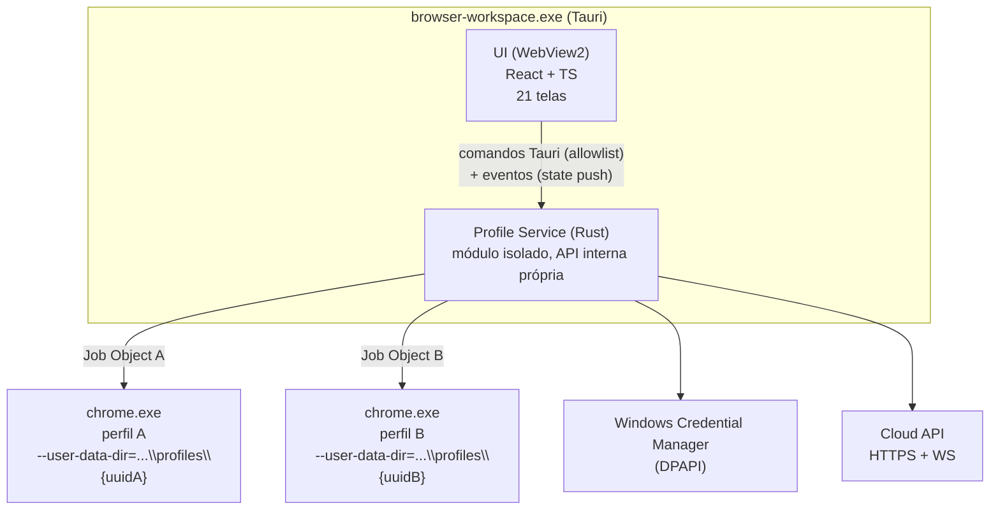
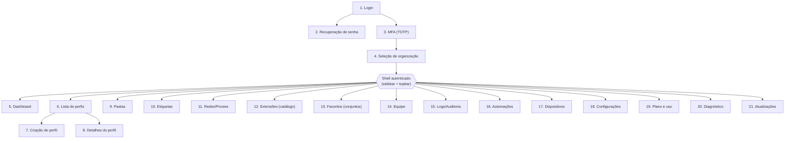

# DESKTOP_ARCHITECTURE — Browser Workspace Desktop Client

> Detalhamento do cliente desktop (MVP Windows-only). Stack: Tauri 2.x + Rust + React/TS (ADR-001).
> O desktop NÃO embute navegador para perfis: gerencia processos Chromium **externos**.
> Limite ético reiterado: nenhuma alteração de fingerprint, nenhum mascaramento de automação.

## 1. Modelo de processos



| Processo | Papel | Privilégio |
|---|---|---|
| UI (WebView2) | Renderização, entrada do usuário. Zero acesso a FS/segredos/processos | Usuário, sandbox WebView2, CSP estrita |
| Profile Service (Rust) | Diretórios, leases, spawn/kill, sync, segredos, watchdog | Usuário (sem admin) |
| Chromium por perfil | Navegação do usuário final | Usuário; processo filho em Job Object dedicado |

Regras do IPC UI↔Core:
- Comandos Tauri com **allowlist explícita**; payloads validados (serde) nos dois lados.
- Nenhum comando retorna segredo em claro (senha de proxy → sempre mascarada; teste de proxy acontece no core).
- No MVP o core roda in-process; a fronteira modular permite extração futura para Windows Service, quando o IPC vira loopback `127.0.0.1` com **token efêmero** por sessão (gerado no boot do serviço, entregue apenas ao processo UI via handle herdado, origem validada, sem porta pública) — modelo exigido pela spec §Autenticação.

## 2. Ciclo de vida do perfil — state machine (8 status da spec)

```mermaid
stateDiagram-v2
    [*] --> disponivel: criação
    disponivel --> sincronizando: abrir (sync check/download)\nou sync pós-fechamento
    sincronizando --> em_uso: abertura concluída (passos 1-9)
    sincronizando --> disponivel: sync concluído
    sincronizando --> com_erro: falha de integridade/download
    disponivel --> em_uso: abertura sem delta remoto
    em_uso --> sincronizando: encerramento (upload snapshot)
    em_uso --> com_erro: crash do Chromium /\nlease perdido / disco cheio
    com_erro --> disponivel: recuperação/reconciliação OK
    com_erro --> bloqueado: intervenção admin
    disponivel --> bloqueado: bloqueio admin/política
    bloqueado --> disponivel: desbloqueio
    disponivel --> aguardando_atualizacao: versão Chromium/formato\nincompatível
    aguardando_atualizacao --> disponivel: migração aplicada\n(com backup prévio)
    disponivel --> arquivado: arquivar
    arquivado --> disponivel: restaurar
    disponivel --> excluido: excluir (confirmação;\nsoft delete + janela de recuperação)
    arquivado --> excluido: excluir
    excluido --> disponivel: recuperar (dentro da retenção)
    excluido --> [*]: expurgo definitivo
```



Invariantes:
- `em_uso` exige lease válido no backend; perda de heartbeat confirmada → transição forçada para `com_erro` local e sync de emergência.
- `excluido` respeita critério 15 do MVP: confirmação explícita + recuperável durante a retenção.
- Transições são registradas no histórico do perfil e na auditoria.

## 3. Diretórios isolados

```
%LOCALAPPDATA%\BrowserWorkspace\
  profiles\
    {uuid}\
      chromium\          # --user-data-dir aponta AQUI (dados do Chromium intocados)
      meta.json          # versão do formato, checksums, snapshot base, flags de estado
      lock               # arquivo de lock local (PID + device_session_id + timestamp)
      staging\           # downloads de sync antes da troca atômica
      backup\            # backup pré-migração de formato
  logs\                  # logs locais estruturados (sem segredos — redação na origem)
  temp\                  # temporários; limpos no boot do serviço
```

- **Validação de permissões do SO** na criação e a cada abertura: ACL restrita ao usuário atual; falha → `com_erro`.
- **Detecção de corrupção**: checksums do `meta.json` + sanidade dos arquivos-chave do Chromium; corrupção → tentar restauração do snapshot mais recente (nunca sobrescrever silenciosamente).
- **Versão do formato** em `meta.json`; migração exige backup prévio em `backup\` (spec §Isolamento local).
- **Bloqueio concorrente local**: arquivo `lock` com PID — segunda instância do app na mesma máquina não abre o mesmo perfil; lease cobre o caso entre máquinas.
- **Troca atômica**: sync aplica novo estado em `staging\` e faz rename atômico; falha em qualquer ponto preserva o estado anterior (critério 14).
- **Segredos NUNCA no diretório do perfil** — ver §6.

## 4. Lançamento do Chromium

### 4.1 Descoberta e versão
`packages/browser-core` localiza binários (Chrome estável instalado e/ou Chromium gerenciado pelo app em `%LOCALAPPDATA%\BrowserWorkspace\runtime\{versão}\`), valida versão mínima/bloqueada (política do backend) e assinatura do binário gerenciado.

### 4.2 Flags de lançamento

```
chrome.exe
  --user-data-dir="...\profiles\{uuid}\chromium"   # isolamento: TODO o estado do perfil
  --no-first-run                                    # sem wizard inicial
  --no-default-browser-check                        # sem prompt de navegador padrão
  --proxy-server="socks5://host:port"               # rede por perfil (quando configurada)
  --proxy-pac-url="https://..."                     # alternativa PAC
  --disable-background-networking                   # reduz tráfego fora do controle do perfil (avaliar por versão)
```

- **Proxy por perfil**: tipo direto/HTTP/HTTPS/SOCKS5/PAC via flags acima. Credenciais de proxy **não vão em linha de comando** (visível em `wmic`/Process Explorer): autenticação respondida via desafio do navegador ou extensão corporativa interna de auth de proxy; credenciais saem do Credential Manager só em memória do core. Nunca logar senha; mascarar na UI.
- **Política de extensões**: catálogo aprovado aplicado por perfil — extensões autorizadas provisionadas no diretório do perfil (unpacked assinado internamente ou via policies `ExtensionInstallForcelist`/`ExtensionInstallAllowlist` aplicadas por chaves de política locais no escopo do perfil gerenciado); extensões fora do catálogo bloqueadas via `ExtensionInstallBlocklist=*`. Auditoria de instalação/remoção; exibição de permissões da extensão na UI.
- **Explicitamente NÃO fazemos**: nenhuma flag/injeção que altere Canvas/WebGL/AudioContext, fontes, `hardwareConcurrency`, Client Hints, WebRTC para mascarar origem, User-Agent arbitrário. O que o site vê é o Chromium real da máquina real.

### 4.3 Supervisão do processo
- Processo criado **dentro de um Job Object** com `JOB_OBJECT_LIMIT_KILL_ON_JOB_CLOSE` → encerrar o job mata toda a árvore (renderers, GPU process, utility) — critério 4 do MVP.
- Handle do processo raiz aguardado de forma assíncrona (`WaitForSingleObject` em task dedicada) → detecção imediata de término.
- Encerramento gracioso: sinal de fechamento à janela (WM_CLOSE) → timeout (ex.: 15 s) → kill do Job Object.

## 5. Detecção de crash e processos órfãos

| Cenário (nº do teste da spec) | Detecção | Ação |
|---|---|---|
| Chromium trava/fecha inesperado (4) | Handle sinaliza saída com lease ainda ativo e sem pedido de fechamento | Marcar `com_erro` → verificação de integridade → sync de emergência → liberar lease → evento de auditoria → oferecer reabertura |
| App fecha abruptamente (3) | No boot, `lock` files com PID morto + leases próprios no backend | Reconciliação: para cada perfil "aberto" na sessão anterior — matar remanescentes (Job Object nomeado por uuid), validar integridade, sync, liberar/retomar lease |
| Processo órfão (16) | Varredura no boot e periódica: processos `chrome.exe` cujo `--user-data-dir` aponta para `profiles\{uuid}` sem sessão ativa correspondente | Kill da árvore + log + auditoria; diretório passa por verificação de integridade |
| Lease expira indevidamente (17) | Heartbeat rejeitado (lease não é mais nosso) | NÃO matar o navegador do usuário às cegas: notificar, tentar readquirir; se impossível, fechamento gracioso com sync de emergência e estado `com_erro` para reconciliação |
| Disco cheio (14) | Verificação de espaço antes de abrir/sincronizar; erros de I/O monitorados | Bloquear novas aberturas, alertar, jamais truncar dados de perfil |

## 6. Segredos no Windows (DPAPI / Credential Manager)

- Armazenados via **Windows Credential Manager** (`CredWriteW`, escopo do usuário, cifrado por DPAPI): refresh token OAuth, token de dispositivo, credenciais de proxy, DEKs de perfil embrulhadas (ver SYNC_PROTOCOL §criptografia).
- Convenção de alvo: `BrowserWorkspace/{tipo}/{id}` (ex.: `BrowserWorkspace/proxy/{network_config_id}`).
- Nunca: em `meta.json`, no diretório do Chromium, em logs (redação automática no logger), no localStorage do WebView, em linha de comando.
- Revogação de dispositivo (remota, via backend) → core apaga credenciais locais e invalida DEKs embrulhadas na próxima conexão; sem o wrap da nuvem, dados cifrados locais tornam-se irrecuperáveis naquele dispositivo.

## 7. Atualizações (app e Chromium)

| Aspecto | App (Tauri) | Chromium gerenciado |
|---|---|---|
| Canais | `stable` / `beta` / `internal` (escolha por org/dispositivo, política do backend) | Idem, com versão mínima e blocklist de versões inseguras |
| Transporte | HTTPS apenas, origem verificada (domínio próprio de release) | HTTPS apenas, origem verificada |
| Verificação | Assinatura do updater Tauri (minisign) **e** Authenticode no instalador; checksum SHA-256 publicado | Checksum SHA-256 + assinatura do pacote conferidos antes de extrair; extração em diretório versionado (`runtime\{versão}\`) |
| Rollback | Manter versão anterior instalável; update falho (13) não pode deixar app inoperante — aplicar em staging e trocar no relaunch | Versões lado a lado; rollback = apontar perfis de volta; **compatibilidade de perfis**: downgrade de Chromium com perfil já migrado é bloqueado (perfil marca versão mínima em `meta.json` → status `aguardando_atualizacao`) |
| Rollout | Gradual por percentual/anel, controlado por feature flag no backend | Idem |
| Pré-condições | Nenhum perfil `em_uso` durante troca do runtime; backup pré-migração de formato | Idem |

## 8. As 21 telas — hierarquia de navegação



- **Fluxo de autenticação** (1–4): fora do shell; MFA e seleção de org condicionais.
- **Lista de perfis (6)** é a tela central: tabela rica — colunas configuráveis, filtros combináveis, ordenação, paginação, multi-seleção, ações em lote, views salvas, atalhos de teclado, menu contextual, estados de loading/empty/error.
- **Detalhes do perfil (8)** em abas: Geral, Rede, Extensões, Favoritos, Histórico de alterações, Notas/Campos custom, Perigo (limpar dados, arquivar, excluir).
- Toda ação sensível na UI é apenas *gatilho*; permissão é revalidada no backend, e a UI reflete negações com erro RFC 7807.
- Telas 15–17, 19: dependem de permissões (auditor, financeiro etc.); renderização condicionada a papel, sem confiar nisso como segurança.

## 9. Logs e diagnóstico locais

- Logs estruturados (JSON) com rotação, correlation id propagado do backend, **redação de segredos na origem** (critério 6 do MVP).
- Tela de Diagnóstico (20): checks de WebView2, espaço em disco, permissões de diretório, conectividade com API, versão do Chromium, integridade de perfis, credenciais presentes — exportável para suporte (sem segredos).
